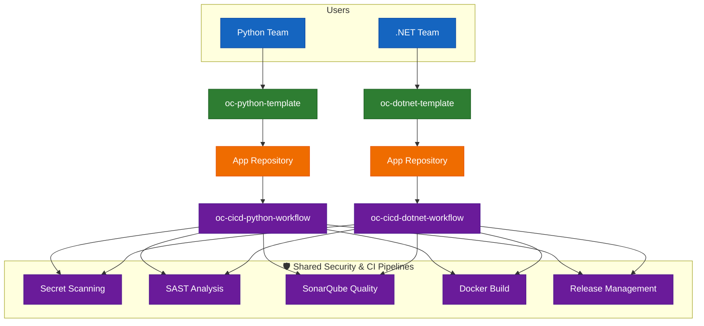
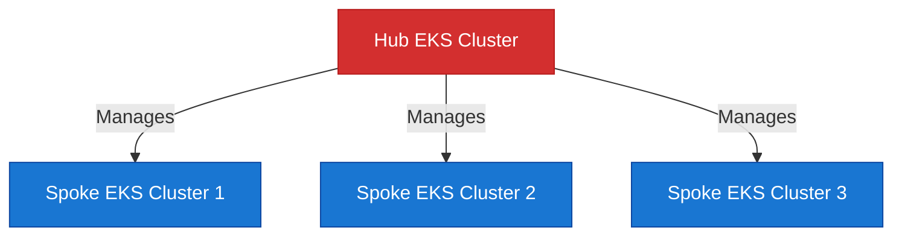

# OrbitCluster CI/CD Platform

### Accelerating Software Delivery with Automated Excellence

---

## 📈 Platform Activity

  

---

## 🚀 Overview

Welcome to **OrbitCluster**, the centralized CI/CD platform designed to streamline, secure, and accelerate your software delivery lifecycle.

Our mission is to provide a robust, standardized, and automated ecosystem that empowers development teams to focus on building features while we handle the heavy lifting of:

- **Building & Testing** across multiple languages.
- **Security Enforcement** with secret scanning and vulnerability checks.
- **Quality Assurance** via automated code analysis.
- **Seamless Deployment** to target environments.

## 🛠️ Architecture

Our platform leverages a modular design where optimized **Templates** consume powerful **Shared Workflows** to deliver consistent results.

## ☁️ OrbitCluster EKS Platform

Beyond CI/CD, we provide a comprehensive **EKS Platform** built on a **Hub and Spoke** architecture to manage Kubernetes workloads at scale.

### Core Components

- **EKS**: Managed Kubernetes for container orchestration.
- **Istio**: Service mesh for traffic management, security, and observability.
- **ArgoCD**: GitOps continuous delivery tool.

### Hub & Spoke Architecture

We utilize a centralized management plane (Hub) to control workload clusters (Spokes), ensuring isolation and scalability.

### Key Principles

- **Centralization**: Core components managed from a single Hub.
- **Scalability**: Auto-scaling clusters to handle dynamic loads.
- **Security & Compliance**: Strict access controls and encrypted traffic.
- **Infrastructure as Code**: Fully provisioned via Terraform & Terragrunt.

## 🧩 Key Features

| Feature                      | Tooling                                                                        | Description                                                  |
| ---------------------------- | ------------------------------------------------------------------------------ | ------------------------------------------------------------ |
| **Secret Scanning**          |  | Prevents credentials and secrets from entering the codebase. |
| **Code Quality**             |       | Automated static analysis to maintain high code standards.   |
| **Vulnerability Assessment** |           | Scans containers and dependencies for known CVEs.            |
| **Standardized Builds**      |          | Unified build processes for consistency across all apps.     |

## 📚 Repository Index

### 📦 Application Templates

Start your new project with best practices built-in:

- **[🐍 oc-python-template](https://github.com/orbitcluster/oc-python-template)** - For Python applications.
- **[🔷 oc-dotnet-template](https://github.com/orbitcluster/oc-dotnet-template)** - For .NET Core applications.

### 🔄 Language Workflows

Orchestration for specific language ecosystems:

- **[oc-cicd-python-workflow](https://github.com/orbitcluster/oc-cicd-python-workflow)**
- **[oc-cicd-dotnet-workflow](https://github.com/orbitcluster/oc-cicd-dotnet-workflow)**

### ⚡ Shared Core Actions

The building blocks of our CI/CD pipeline:

- **[🔒 oc-cicd-secretscanner-workflow](https://github.com/orbitcluster/oc-cicd-secretscanner-workflow)**
- **[🔍 oc-cicd-sast-workflow](https://github.com/orbitcluster/oc-cicd-sast-workflow)**
- **[📊 oc-cicd-sonarscan-workflow](https://github.com/orbitcluster/oc-cicd-sonarscan-workflow)**
- **[🐳 oc-cicd-docker-build-workflow](https://github.com/orbitcluster/oc-cicd-docker-build-workflow)**
- **[🚀 oc-cicd-release-workflow](https://github.com/orbitcluster/oc-cicd-release-workflow)**

---

  Built with ❤️ by the OrbitCluster Platform Engineering Team

